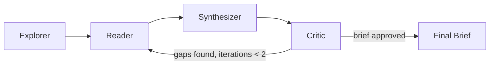

# Codebase Onboarding Agent

[](https://github.com/Aditya-GitHub-02/codebase-onboarding-agent/actions/workflows/ci.yml)

Drop in a GitHub repo URL, get back an AI-generated onboarding brief in seconds — without reading the whole codebase.

**Try it live:** _(Hugging Face Space URL goes here once deployed)_

## The problem

Landing on an unfamiliar codebase is slow. You clone it, open a dozen files at random, skim a README that's three years out of date, and spend an hour just figuring out where the entry point is before you can make a single useful change. This agent automates that first hour: it explores a repo's structure, reads only the files that actually matter, and writes a structured brief — overview, architecture, key modules, entry points, and suggested first tasks — so a human can start from an informed position instead of zero.

## How it works

A 4-node LangGraph agent loop, backed by Groq's `llama-3.3-70b-versatile`:



- **Explorer** — pulls repo metadata and the full file tree from the GitHub API, then scores every path with the filtering heuristic below to pick ~12 files worth reading.
- **Reader** — fetches the content of each priority file and asks the LLM for a 2-3 sentence summary of its purpose.
- **Synthesizer** — combines the README, repo metadata, and file summaries into a structured markdown brief (Overview, Tech Stack & Dependencies, Architecture, Key Modules, Entry Points, Suggested First Tasks), instructed to cite specific file paths rather than write generic filler.
- **Critic** — checks the draft against the *full* file tree and asks: did we miss an obviously important file (entry point, core config, CI setup)? If so, it adds up to 3 more files and loops back to the Reader. Capped at 2 iterations to bound cost.

## The filtering strategy

Reading every file in a repo before summarizing it doesn't scale — it's slow, and it burns tokens on `node_modules`, lockfiles, and generated code that tell you nothing about the architecture. Instead, `select_priority_files` (in [`src/nodes.py`](src/nodes.py)) scores files using **path and filename heuristics only, before any content is read**:

- Always includes README, dependency manifests (`package.json`, `pyproject.toml`, `requirements.txt`), and common entry-point filenames.
- Boosts files under top-level `src/` or `app/` directories, and files with `main`, `core`, or `config` in the name.
- Deprioritizes test files, `node_modules`/`vendor`/`dist`/`build`, lockfiles, and other generated artifacts.
- Caps the result at a configurable max (default 12) so token usage stays bounded regardless of repo size.

This is the project's core differentiator: engineering judgment about *what's worth reading* substitutes for brute-force ingestion, keeping the agent fast and cheap even on large repos. The Critic node exists precisely to catch what this heuristic misses, without paying the cost of reading everything up front.

## Tech stack

- [LangGraph](https://github.com/langchain-ai/langgraph) — agent state graph and control flow
- [langchain-groq](https://github.com/langchain-ai/langchain) + Groq's `llama-3.3-70b-versatile` — fast, free-tier LLM inference
- [Streamlit](https://streamlit.io/) — UI with a live, streaming agent trace
- GitHub REST API (`requests`) — repo metadata, file tree, and file content
- `pytest` + `pytest-cov` — unit tests with mocked network/LLM calls

## Quickstart

```bash
git clone https://github.com/Aditya-GitHub-02/codebase-onboarding-agent.git
cd codebase-onboarding-agent
python3 -m venv .venv && source .venv/bin/activate
pip install -r requirements.txt

cp .env.example .env
# then edit .env and set GROQ_API_KEY (required) and GITHUB_TOKEN (optional, raises rate limit)

streamlit run app.py
```

## Example output

Sample brief generated for `octocat/Hello-World`:

```markdown
## Overview
A minimal "Hello World" repository used as GitHub's canonical example for
first-time Git and pull-request workflows.

## Architecture
Single-file repo with no build system or dependency graph — it exists to
demonstrate the fork/clone/PR flow rather than to run as an application.

## Key Modules
- `README`: the only file, describing the repo's purpose.

## Entry Points
None — this repo is not executable.

## Suggested First Tasks
- Read the README to understand GitHub's onboarding flow.
- Try opening a pull request against this repo as a Git practice exercise.
```

## Testing

```bash
pytest -m "not integration" --cov=src --cov-report=term-missing
```

Unit tests mock all network and LLM calls, so no API keys are required. A separate integration test (`tests/test_graph.py`, marked `@pytest.mark.integration`) runs the full graph against a real repo and is skipped unless `GROQ_API_KEY` and `GITHUB_TOKEN` are set.

## License

MIT
